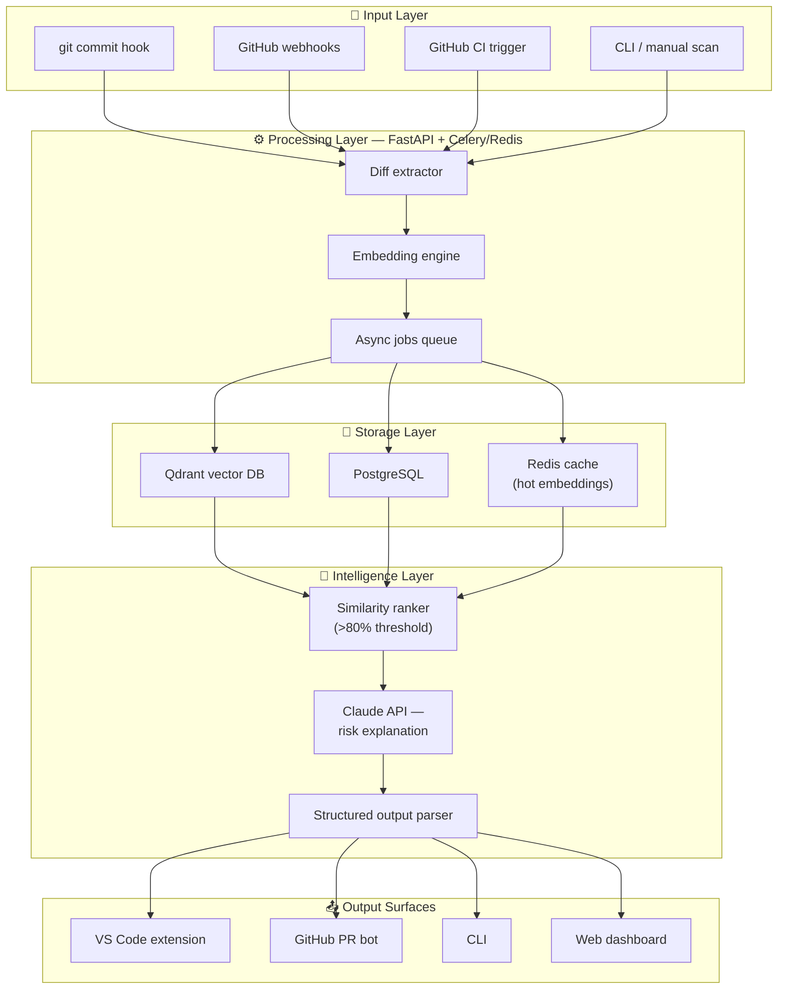
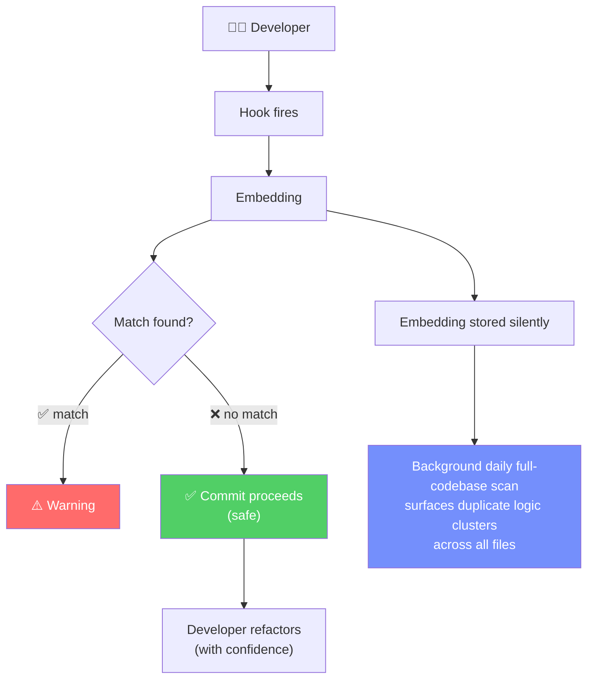

< — *Powering The Hackathon Ecosystem*

---

## Team Name : **JUGAADU**

| Member | Role | Email |
|--------|------|-------|
| **Kripasindhu Ghosh** | Leader | [ghoshkripa521@gmail.com](mailto:ghoshkripa521@gmail.com) |
| **Piuli Biswas** | Member | [piulibiswas34@gmail.com](mailto:piulibiswas34@gmail.com) |
| **Amrit Kar** | Member | [amritkar76@gmail.com](mailto:amritkar76@gmail.com) |
| **Abhinandan Ghosh** | Member | [ghoshabhinandan290@gmail.com](mailto:ghoshabhinandan290@gmail.com) |

---

# Problem Statement

Git tracks **text-level diffs** — it knows which lines changed, but has **zero understanding** of what the code *means*. This leads to a recurring pattern across engineering teams:

- A developer introduces a change that is **semantically identical** to a past commit that was **reverted**, **caused a bug**, or **broke production** — and nobody catches it until it's too late.
- **Duplicated logic** accumulates silently across files and services, because no tool connects the meaning of code written months apart by different people.
- Code reviews rely entirely on **human memory** — reviewers can only flag patterns they personally remember.

**The result:** Teams keep re-introducing the same mistakes. Institutional knowledge lives in people's heads, not in the toolchain.

### What We're Building

**SemanticVCS** — a **semantic version control layer** that sits on top of Git and understands **what code does**, not just what it looks like.

It uses **UniXCoder** (a unified cross-modal pre-trained model for code) to embed every function-level code change into a **768-dimensional vector**, stores those vectors in **Qdrant** (a purpose-built vector database), and performs **approximate nearest-neighbor (ANN) search** against the full commit history on every new commit.

When a new commit is semantically similar to a past problematic commit (reverted, bug-linked, or flagged), the developer gets an **immediate, actionable warning** — before the PR is even opened.

---

# Detailed Proposal & Solution Approach

## The 5-Stage SemanticVCS Pipeline

| Stage | What Happens | Output |
|-------|-------------|--------|
| **1. Code Embedding** | On every commit (via post-commit hook), SemanticVCS extracts function-level diffs using AST parsing. Each function is tokenized and passed through **UniXCoder** (ONNX-optimized) to produce a **768-dimensional embedding vector**. | One embedding vector per changed function, tagged with commit SHA, author, timestamp, file path. |
| **2. Vector Storage** | The embedding — along with rich metadata (revert status, linked bug IDs, PR outcome) — is upserted into **Qdrant**, a vector database optimized for high-dimensional similarity search. | Persistent, indexed vector with full provenance metadata in Qdrant collection. |
| **3. ANN Search** | The new embedding is searched against the **entire historical vector space** using HNSW (Hierarchical Navigable Small World) indexing. Matches above an **80% cosine similarity threshold** are flagged. | Ranked list of semantically similar past commits with similarity scores. |
| **4. LLM Contextualization** | Flagged matches are sent to **Claude API** (Anthropic) with both the current diff and the historical diff. The LLM generates a **structured risk explanation**: what's similar, why it was problematic before, and what the developer should check. | Structured JSON: `{ risk_level, explanation, historical_context, suggested_action }` |
| **5. Duplicate / Risk Detection** | Results are surfaced through multiple channels: **VS Code extension** (inline warnings), **GitHub PR bot** (auto-comment), **CLI** (terminal output), and **Web dashboard** (team-wide analytics). Background daily scans also surface **duplicate logic clusters** across the entire codebase. | Actionable warnings delivered to the developer in their existing workflow. |

---

## Detailed Proposal & Solution Approach *(Continued)*

### Outcome-aware search

Not just "similar code" — but "similar code that failed". The vector DB stores revert status and bug linkage as first-class metadata. Similarity score × bad outcome = actionable warning.

### Function-level granularity

Most tools work at file or PR level. SemanticVCS embeds at function level — the atomic unit of logic — so renames and refactors don't fool it.

### Zero friction for the developer

No new workflow. Just a post-commit hook. The developer keeps using git normally. SemanticVCS works silently in the background.

### Grows smarter over time

Every commit — matched or not — is stored. The longer a team uses it, the richer the semantic memory becomes. Early commits seed future warnings.

### Real-world impact (illustrative scenario):

A junior developer introduces a JWT validation change. SemanticVCS detects 94% semantic similarity to a commit from 14 months ago — a commit reverted after a security audit revealed a token replay vulnerability. The developer is warned before the PR is even opened.

---

This is not a linter. This is not a code search tool. This is not an another AI code reviewer.

It's a **memory**. One that compounds. The first commit seeds the database. By commit 10,000, the system knows the codebase's full failure history and can match against every decision ever made.

> **The key insight we're working from:** Most production bugs aren't new. They're old bugs that came back in a slightly different shape — and nobody remembered the original fix or why it was done that way. We want to make that knowledge impossible to lose.

---

## SemanticVCS — System Architecture

---

## Developer User Flow

> *e.g. "You have 4 implementations of retry-with-backoff across 4 services — here they are"*

---

# Tools and Stacks Used in Development

| Category | Tool / Technology | Purpose |
|----------|------------------|---------|
| **Code Embedding Model** | UniXCoder (microsoft/unixcoder-base) | Encodes function-level code into 768-dim vectors |
| **Model Runtime** | ONNX Runtime | Optimized inference for UniXCoder embeddings |
| **Vector Database** | Qdrant Cloud (free tier) | Stores and indexes code embeddings for ANN search |
| **ANN Search Index** | HNSW Index | Hierarchical Navigable Small World — fast similarity search |
| **Backend Framework** | FastAPI | Async Python API server |
| **Task Queue** | Celery + Redis | Background job processing for embedding and scanning |
| **Managed Cache** | Upstash (managed Redis, free tier) | Hot embedding cache, task broker |
| **Relational Database** | Supabase (managed PostgreSQL) | Commit metadata, user data, audit logs |
| **LLM API** | Anthropic Claude API / Gemini API / OpenAI | Risk explanation and structured analysis |
| **IDE Extension** | TypeScript (VS Code Extension) | Inline warnings and developer interface |
| **Containerization** | Docker Compose | Local development and deployment orchestration |
| **Language** | Python 3.11+ | Core backend and ML pipeline |
| **Development Machine** | Personal Laptop / Dev Machine | Local development environment |

---

# References / Acknowledgement

| Reference | Link |
|-----------|------|
| UniXcoder: Unified Cross-Modal Pre-Training for Code | [https://arxiv.org/abs/2203.03850](https://arxiv.org/abs/2203.03850) |
| CodeBERT: A Pre-Trained Model for Programming and Natural Language | [https://arxiv.org/abs/2002.08155](https://arxiv.org/abs/2002.08155) |
| Qdrant Vector Database — Official Documentation | [https://qdrant.tech/documentation/](https://qdrant.tech/documentation/) |
| HuggingFace — UniXCoder Model Card | [https://huggingface.co/microsoft/unixcoder-base](https://huggingface.co/microsoft/unixcoder-base) |
| FastAPI — Official Documentation | [https://fastapi.tiangolo.com/](https://fastapi.tiangolo.com/) |
| Supabase — Official Documentation | [https://supabase.com/docs](https://supabase.com/docs) |
| Anthropic Claude API — Official Documentation | [https://docs.anthropic.com/](https://docs.anthropic.com/) |
| PyDriller — Python Framework for Mining Git Repositories | [https://pydriller.readthedocs.io/](https://pydriller.readthedocs.io/) |

---

# THE END

### 🏴‍☠️ HACKERS

]]>
